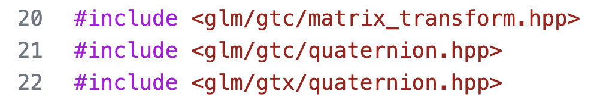
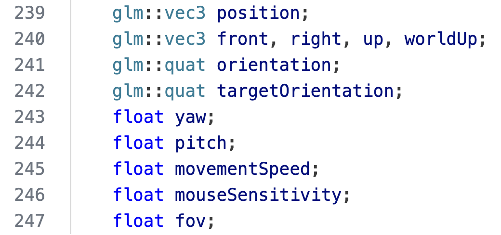
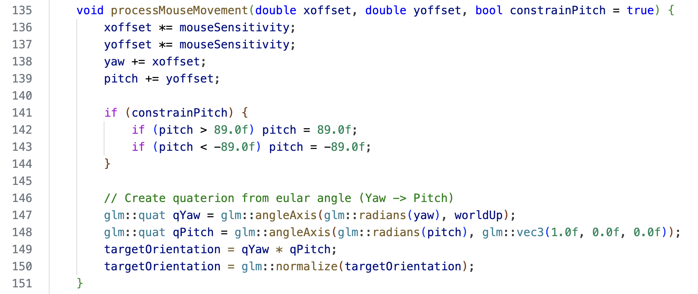
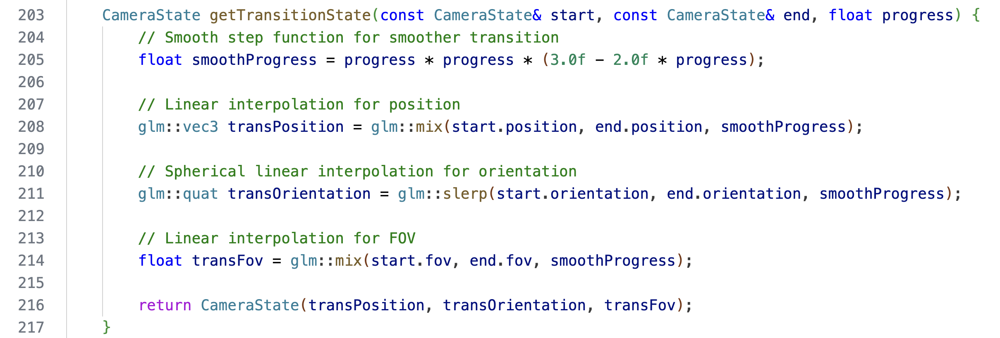

# Hand

北京大学图形学课程小作业代码。

> 注：Assimp是经过裁剪的版本，只支持FBX文件的导入

# 构建
在 MacOS 上写的作业。
```shell
# 0. Clone from github
git clone https://github.com/xuehaonan27/hand-graphics-homework-main.git

# 1. To root directory
cd hand-graphics-homework-main

# 2. Build the project
mkdir build
cd build
cmake .. -DCMAKE_POLICY_VERSION_MINIMUM=3.5
make
cd src/

# 3. Run the binary
./Hand
```

# 帮助
1. 作业二
   1. F键：启用 / 禁止相机控制（**默认禁用**）
   2. R键：重置相机位置和视角
   3. H键：打印帮助
2. 相机控制（F键启用相机控制）
   1. W：相机前移
   2. S：相机后移
   3. A：相机左移
   4. D：相机右移
   5. Left Shift：相机下降
   6. Space：相机上升
   7. 鼠标移动：控制相机视角
   8. 鼠标滚轮：相机视野放大 / 缩小
   9. Q：降低相机移动速度
   10. E：提高相机移动速度
3. 位置平滑过渡
   1. G：记录当前相机状态（位置 + 视角），第一次按动记录状态 A，第二次按动记录状态 B
   2. P：播放从状态 A 到状态 B 的连续平滑过渡
   3. O：播放从状态 B 到状态 A 的连续平滑过渡
   4. K：清空记录的相机状态
4. 手部模型控制：
   1. 按键 1/2/3：手模型执行预设的动作1/2/3（作业一）
   2. 按键 9：手模型默认旋转
   3. 按键 0：手模型默认静止
   4. Z/X/C/V/B：控制五根手指弯曲 / 伸直


# 快速演示
1. 编译构建完成后，运行程序
2. 按 F 进入自由相机模式，使用 WASD, Left Shift, Space 以及鼠标体验相机控制。
3. 在合适的位置按 G 记录相机状态 A。
4. 在另一个位置按 G 记录相机状态 B。
5. 按 P 播放从 A 到 B 的连续平滑过渡。
6. 按 O 播放从 B 到 A 的连续平滑过渡。
7. 按 K 清空状态。
8. 如果遇到相机距离过远等情况，按 R 重置相机到初始状态。

# GLM 库 Quaterion 四元数使用情况展示
1. 使用了 GLM 库的四元数功能。
<div align="center">
    
</div>

1. 在 QuaterionCamera 类定义中采用了四元数表示和处理相机朝向。
<div align="center">
    
</div>

1. 在处理鼠标输入更改相机朝向时，利用四元数。
<div align="center">
    
</div>

1. 在实现连续平滑过渡时，利用四元数插值法。
<div align="center">
    
</div>
